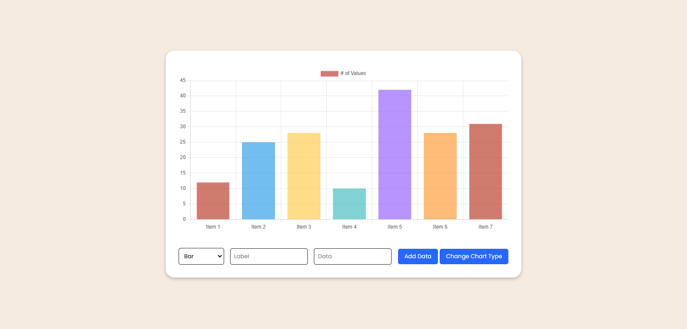
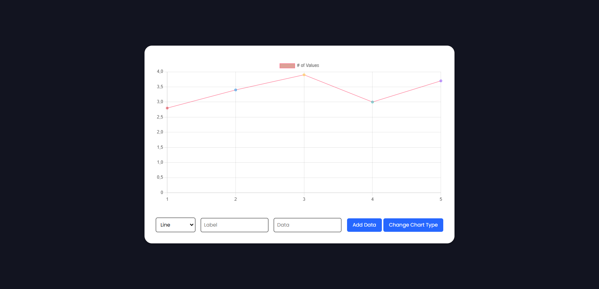
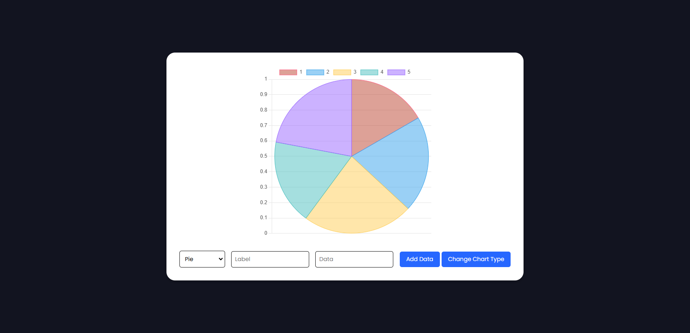

# 📊 Dynamic Data Chart Project

This project enables users to dynamically add and display data on a chart, with the ability to input as many values as desired. Built with **JavaScript** and the **Chart.js Library**, the application provides an intuitive and engaging interface for data visualization.

Users can switch between five different chart types to best suit their preferences: **bar**, **line**, **pie**, **radar**, and **doughnut**. The project also features **responsive design**, ensuring that charts adapt seamlessly to different screen sizes for an optimal user experience.

Additionally, users can interact with the charts in multiple ways:

- **Remove data points** directly by clicking on them.
- **Hover over data points** to view detailed insights and analyses, such as exact values and proportions.

This project showcases the flexibility and functionality of dynamic data visualization, making it a powerful tool for displaying and analyzing information interactively.

---

# 🛠️ Main Features

- **JavaScript** for dynamic interactivity
- **Chart.js Library** for creating responsive, visually appealing charts
- **Five chart types**: bar, line, pie, radar, and doughnut
- **Dynamic data input** to populate the chart
- **Remove data** by clicking directly on data points
- **Real-time data analysis** by hovering over the chart
- **Fully responsive design** for all screen sizes

---

# 📷 Screenshots

## Chart: Bar

## Chart: Line

## Chart: Pie

